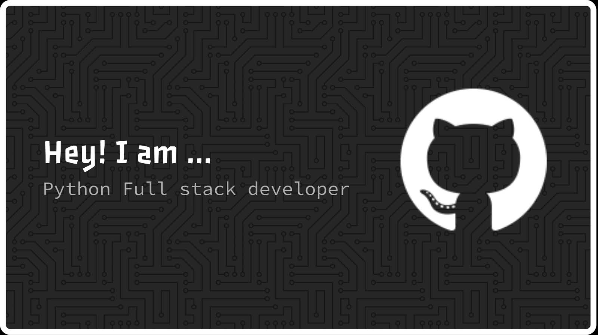

  

 
<h1 align="centre">👋 Hi, I'm Komala Nandini</h1>  

### 🐍 Python Full-Stack Developer | 💻 Web Developer | 🎓 CSE (AI & ML)

Building responsive and practical web applications with a focus on
**Python, frontend development, backend engineering, databases,
REST APIs, and software development.**

 

&nbsp;

&nbsp;

  

---

## 👩‍💻 About Me

I'm a **B.Tech CSE (AI & ML) undergraduate** focused on
**Python Full-Stack Web Development**.

I build responsive web interfaces and practical applications while
strengthening my skills in **Python, JavaScript, backend development,
databases, REST APIs, Git, and software development**.

My learning is driven by **hands-on projects, internship experience,
and continuous technical practice**.

> 💡 **Goal:** Build reliable, responsive, and user-focused applications
> while growing as a Python Full-Stack Developer.

---

## 🎯 What I'm Working On

- 🐍 Building practical applications with **Python**
- ⚛️ Improving **React.js** and modern frontend workflows
- 🔧 Learning **Django, Flask & FastAPI**
- 🗄️ Working with **SQL & MySQL**
- 🔌 Designing and consuming **REST APIs**
- 🧠 Strengthening **DSA and problem-solving with Python**

---

# 🛠️ Tech Stack

### 💻 Languages

### 🌐 Frontend

### ⚙️ Backend — Currently Learning

### 🗄️ Database

### 📱 Mobile Development

### 🔧 Tools

---

# 🚀 Featured Projects

<table>
<tr>

<td width="50%" valign="top">

## 🏠 LearnHome Tuition

### Responsive Home Tuition Website

A responsive website designed to provide a professional online
presence for a home-tuition service.

**Key Features**

- 📱 Responsive design
- 🧭 Structured navigation
- 📚 Programs and services
- 👨‍🏫 Tutor profiles
- 🔎 Class & subject filtering
- 💰 Fee presentation
- 📞 Contact section
- 🎯 Call-to-action sections

**Tech Stack**

`HTML5` `CSS3` `JavaScript` `Responsive Design`

 

</td>

<td width="50%" valign="top">

## 🔐 Secure Password Generator

### Python Desktop Application

A Python-based password generator with a simple graphical interface
and input validation.

**Key Features**

- 🔐 Password generation
- 🔢 Custom password length
- ✅ Input validation
- 🛡️ Length restrictions
- 🖥️ Graphical interface
- ⚡ Simple user experience

**Tech Stack**

`Python` `Tkinter`

 

</td>

</tr>

<tr>

<td width="50%" valign="top">

## 🛒 NANDINI'S ELECTRONICS

### Flutter Electronics Shopping App

A Flutter-based electronics shopping application focused on creating
a realistic product browsing and shopping experience.

**Key Features**

- 📱 Electronics categories
- 🏷️ Brand information
- 💰 Product pricing
- 📦 Product details
- 🛒 Shopping cart
- 💳 Checkout flow
- 📱 Mobile interface

**Tech Stack**

`Flutter` `Dart`

**Status:** 🚧 In Development

</td>

<td width="50%" valign="top">

## 📱 Smart Shopping Navigation

### QR-Based Shopping Concept

A QR-based shopping navigation concept designed to help customers
locate products inside a store.

**Key Features**

- 📷 QR generation
- 🔍 QR scanning workflow
- 🛍️ Product navigation
- 🌐 Customer-facing interface
- 🐍 Python integration

**Tech Stack**

`Python` `HTML` `CSS` `JavaScript` `QR Code`

</td>

</tr>
</table>

---

# 💼 Internship Experience

## 🚀 VEDA TECHNOLOGY

**Web Development Intern · Remote**

Currently gaining hands-on experience through a **Web Development Internship**.

**Focus Areas**

`Web Development` · `Frontend Development` · `Responsive Design`
· `Practical Project Development`

---

## 💻 Oasis Infobyte

**Web Development Intern**

Gained practical experience in **frontend and responsive web development**
through project-based work.

**Technologies**

`HTML5` · `CSS3` · `JavaScript` · `Responsive Web Design`

**Project:** LearnHome Tuition — Responsive Landing Page

---

# 🎓 Education

### B.Tech — Computer Science & Engineering (AI & ML)

**Bharat Institute of Engineering & Technology**

`2024 – Present`

---

# 📜 Certifications & Achievements

- 🐍 **Python Programming Certification — CynoHub**
- 🏆 **Smart India Hackathon (SIH) 2025 — Certificate of Participation**
- 💻 Hands-on project experience in **Python & Web Development**

---

# 📊 GitHub Analytics

---

# 📌 GitHub Overview

---

# 🔥 Contribution Streak

---

# 📈 Contribution Activity

---

# 🏆 GitHub Trophies

---

# 📈 GitHub Activity Summary

---

# 🌱 Currently Learning

| Area | Technologies |
|---|---|
| 🐍 Backend | Django · Flask · FastAPI |
| 🎨 Frontend | React.js · Tailwind CSS |
| 🗄️ Database | SQL · MySQL |
| 🔌 APIs | REST APIs |
| 🧠 Problem Solving | Python DSA |
| 🔧 Development | Git · GitHub |
| 📱 Mobile | Flutter · Dart |

---

# 💡 Developer Mindset

> **Build. Learn. Improve. Repeat.**

 

🐍 **Python** &nbsp; • &nbsp;
🌐 **Web Development** &nbsp; • &nbsp;
🚀 **Projects** &nbsp; • &nbsp;
📚 **Continuous Learning**

---

# 🤝 Let's Connect

&nbsp;

&nbsp;

---

### 💻 Building. Learning. Improving.

**Python Full-Stack Development • Web Development • Open to Opportunities**

 

